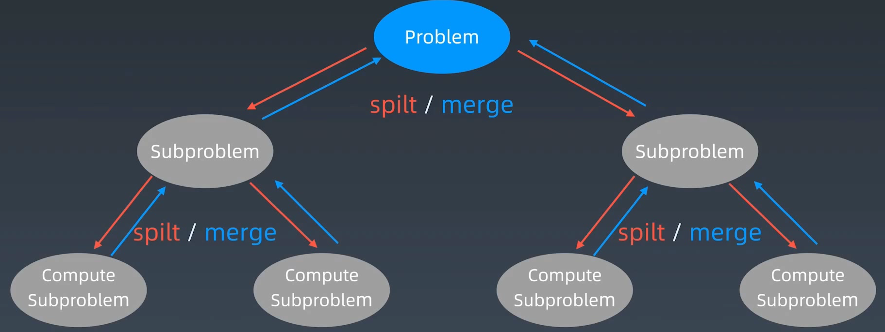

# 分治模板

```java
private static int divide_conquer(Problem problem, ) {
  // 1. recursion terminator
  if (problem == NULL) {
    int res = process_last_result();
    return res;
  }

  // 2. process current problem
  subProblems = split_problem(problem)

  // 2.5. conquer subproblems
  res0 = divide_conquer(subProblems[0])
  res1 = divide_conquer(subProblems[1])

  // 3. merge
  result = process_result(res0, res1); // 组合子结果

  // 4. revert the current level status
  return result;
}
```



