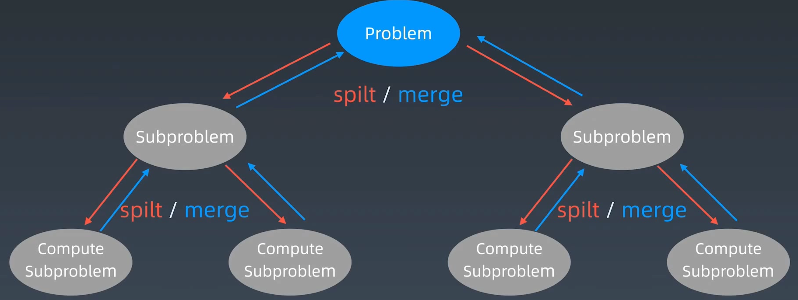

# 递归模板



* 把自己的状态带到下一层，之后又把改变带回来。环境其它属性、方法不受影响
* 寻找**最近重复子问题**
* **最近重复性**
* 最优重复性
* 数学归纳法思维



```java
public void recur(int level, int param1, ..., paramN) {
    // 1. 递归终止条件
    if (level > MAX_LEVEL) { return; }

    // 2. 处理当前层逻辑
    process(level, param);

    // 3. 下探到下一层（可以剪枝）
    recur(level + 1, newParam, ..., newParamN)

    // 4. 清理当前层（可选）
}
```



